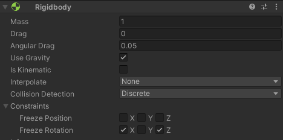
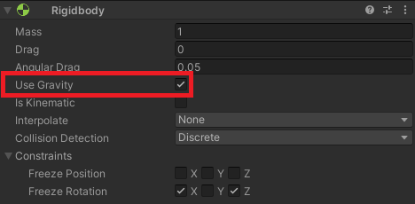
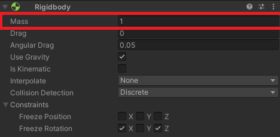
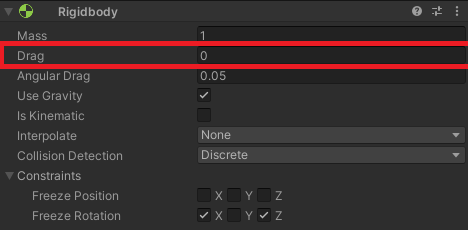
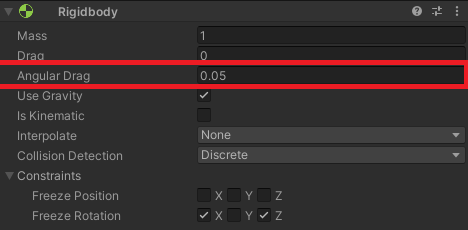
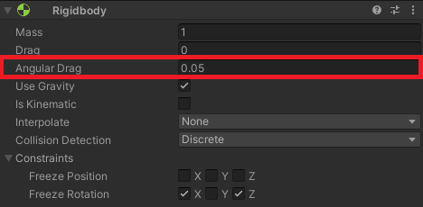
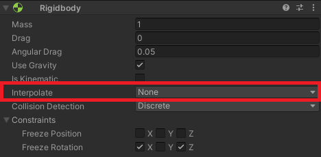
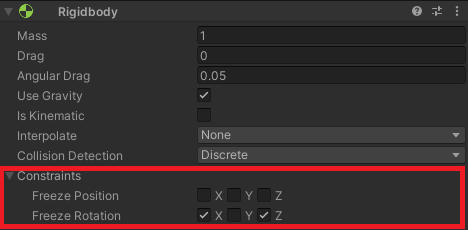
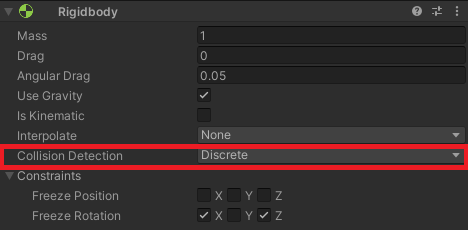
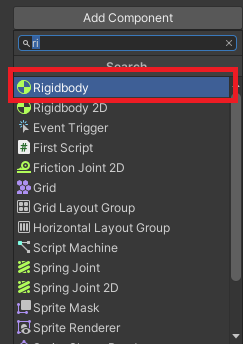

**Rigidbody

**

Rigidbody in Unity allows your GameObjects to act under the control of physics.

It allows you to interact with the physics of your objects and visualize how Unity is trying to simulate the physics of the real world. 

**Rigidbody properties:**

**Use Gravity

**

This property determines whether gravity affects your game object or not. If it’s set to false, then the Rigidbody behaves as if it’s in outer space. In the unity interface, you can use arrow keys to navigate your object in the given plane with the help of arrow keys.

If *gravity* is enabled, the object will fall off as soon as it crosses the plane's boundary. However, if it’s disabled, it’ll continue on its path uninterrupted.

**Mass
**

This property of the Rigidbody is used for defining the mass of your object. By default, the value is read in kilograms. Different Rigidbodies that have a large difference in masses can cause the physics simulation to be highly unstable. The interaction between objects of different masses occurs in the same manner as it would in the real world. For instance, during a collision, a higher mass object pushes a lower mass object more.

A common misconception that rents users’ minds is that heavy objects will fall faster than lighter ones. This doesn’t hold in the world around us, the speed of fall is dictated by the factors of gravity and drag.

**Drag**

Drag can be interpreted as the amount of air resistance that affects the object when moving from forces. When the drag value is set to 0, the object is subject to no resistance and can move freely.

On the other hand, if the value of the drag is set to infinity, then the object's movement comes to an immediate halt. Essentially, drag is used to slow down an object. The higher the value of drag, the slower the movement of the object becomes. 

Users must keep in mind the fact that they can apply Force to an active Rigidbody only. If the GameObject is inactive, then AddForce will not affect. Additionally, the Rigidbody must not be kinematic as well. Once a force is applied, the state of the Rigidbody is set to awake by default. The value of drag influences the speed of movement of an object under force. 

**Angular Drag**

Drag can be interpreted as the amount of air resistance that affects the object when rotating from torque 0. As was the case with Drag, setting the value of Angular Drag to 0 eliminates the air resistance over here as well.

However, by setting the value of the Angular Drag to infinity, you can’t stop the object from rotating. The purpose of Angular Drag is only to slow down the rotation of the object. The higher the value of the Angular Drag, the slower the rotation of the object becomes. 

**Is Kinematic

**

When the *Is Kinematic* property is enabled, the object will no longer be driven by the physics engine. Forces, joints, or collisions will stop having an impact on the Rigibody. In this state, it can only be manipulated by its Transform.

Hitting objects under *Is Kinematic* brings about no change to their state as they can no longer exchange forces. 
This property comes in handy when you want to move platforms or wish to animate a Rigidbody with a HingeJoint attached.

**Interpolate

**

Users are advised to use interpolate in situations where they have to synchronize their graphics with the physics of their GameObject.

As the unity graphics are computed in the update function and the physics in the fixed update function, occasionally, they happen to be out of sync. To fix this lag, Interpolate is used. To learn more about Interpolate.

**Constraints

**

Constraints are used for imposing restrictions on the Rigidbody’s motion. It dictates which degrees of freedom are allowed for the simulation of the Rigidbody. By default, it is set to *RigibodyConstraints.None*.

There are two modes in Constraints- Freeze Position and Free Rotation. While Freeze Position restricts the movement of the Rigidbody in the X, Y, and Z axes, Freeze Rotation restricts their rotation around the same.

**Collision Detection
**

This property is used to keep fast-moving objects from passing through other objects without detecting collisions. For best results, users are encouraged to set this value to *CollisionDetectionMode.ContinuousDynamic* for fast-moving objects. As for the other objects that these need to collide with, you can set them to *CollisionDetectionMode.Continuous*.

These two options are known for having a big impact on physics performance. However, if you don’t have any problems with fast-moving objects colliding with one another, then you can leave it set to the default value of *CollisionDetectionMode.Discrete*. 

**Accessing the Rigidbody component:**

To acces the rigidbody first we must add it to the GameObject,here is how: 

1. select the GameObject that we want to add the Rigibody to it
1. from inspector window click the Add component button
   
1. search for the Rigidbody component select it and add it
   ****
**

After adding a rigidbody we need to access its properties
first, we need to declare it in the script:

using UnityEngine;
public class Example : [MonoBehaviour](https://docs.unity3d.com/ScriptReference/MonoBehaviour.html)

{

`    `[Rigidbody](https://docs.unity3d.com/ScriptReference/Rigidbody.html) m\_Rigidbody;

`    `void Start()

`    `{

`    `}
}

**

To we need to reference the rigidbody
To we need to reference the rigidbody :
in start function using getcomponent which is basically
-------------------------------------------------------
Gets a reference to a component of type T on the specified GameObject.

Syntax:

comonent = gameObject.GetComponent<ComponentType>();

using UnityEngine;
public class Example : [MonoBehaviour](https://docs.unity3d.com/ScriptReference/MonoBehaviour.html)

{

`    `[Rigidbody](https://docs.unity3d.com/ScriptReference/Rigidbody.html) m\_Rigidbody;

`    `void Start()

`    `{ //Fetch the [Rigidbody](https://docs.unity3d.com/ScriptReference/Rigidbody.html) from the [GameObject](https://docs.unity3d.com/ScriptReference/GameObject.html) with this script attached

`        `m\_Rigidbody = GetComponent<[Rigidbody](https://docs.unity3d.com/ScriptReference/Rigidbody.html)>();

`	    `}
}

**

**Rigidbody methods:**

**Add Force**

This method is used to add a force to the Rigidbody. Force is always applied continuously along the direction of the force vector. Further, specifying the Force Mode enables the user to change the type of force to acceleration, velocity change, or impulse. 

**syntax:**

using UnityEngine;

public class Example : [MonoBehaviour](https://docs.unity3d.com/ScriptReference/MonoBehaviour.html)

{

`    `[Rigidbody](https://docs.unity3d.com/ScriptReference/Rigidbody.html) m\_Rigidbody;

`    `public float jumpForce = 350f;

`    `void Start()

`    `{

`     `//Fetch the [Rigidbody](https://docs.unity3d.com/ScriptReference/Rigidbody.html) from the [GameObject](https://docs.unity3d.com/ScriptReference/GameObject.html) with this script attached

`        `m\_Rigidbody = GetComponent<[Rigidbody](https://docs.unity3d.com/ScriptReference/Rigidbody.html)>();

`    `}

`    `void [FixedUpdate](https://docs.unity3d.com/ScriptReference/PlayerLoop.FixedUpdate.html)()

`    `{

`        `if ([Input.GetKeyDown](https://docs.unity3d.com/ScriptReference/Input.GetButton.html)(KeyCode.Space))

`        `{
` `//Apply a force to this [Rigidbody](https://docs.unity3d.com/ScriptReference/Rigidbody.html) in direction of this GameObjects up axis

`            `m\_Rigidbody.AddForce(Vector3.up \* jumpForce);

`        `}

`    `}

}

**AddForce**([Vector3](https://docs.unity3d.com/ScriptReference/Vector3.html) **force**);
Here is an example of using AddForce function to make a player jump.

